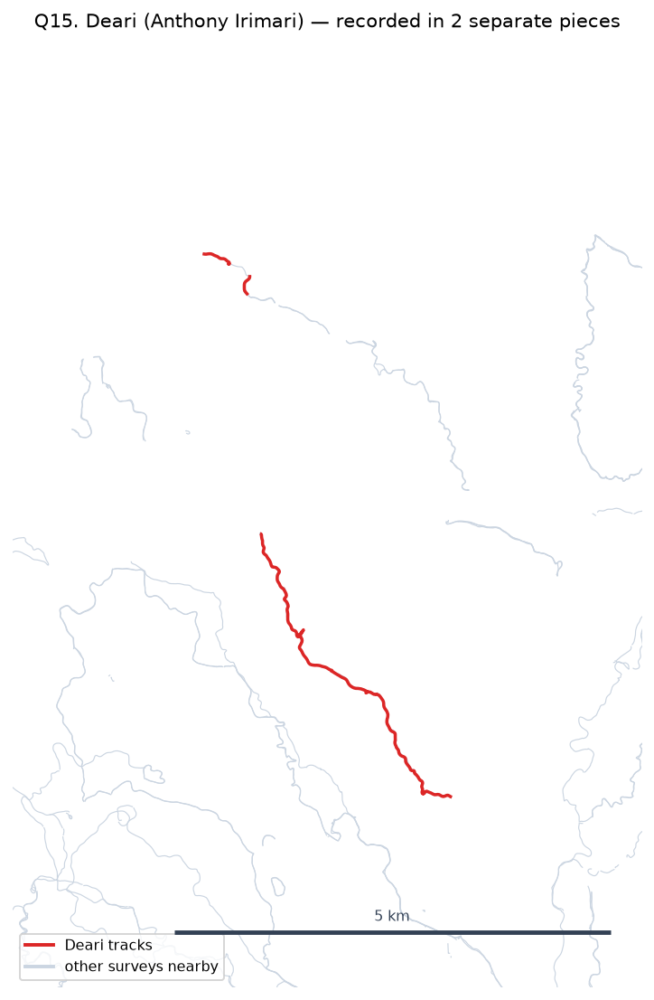
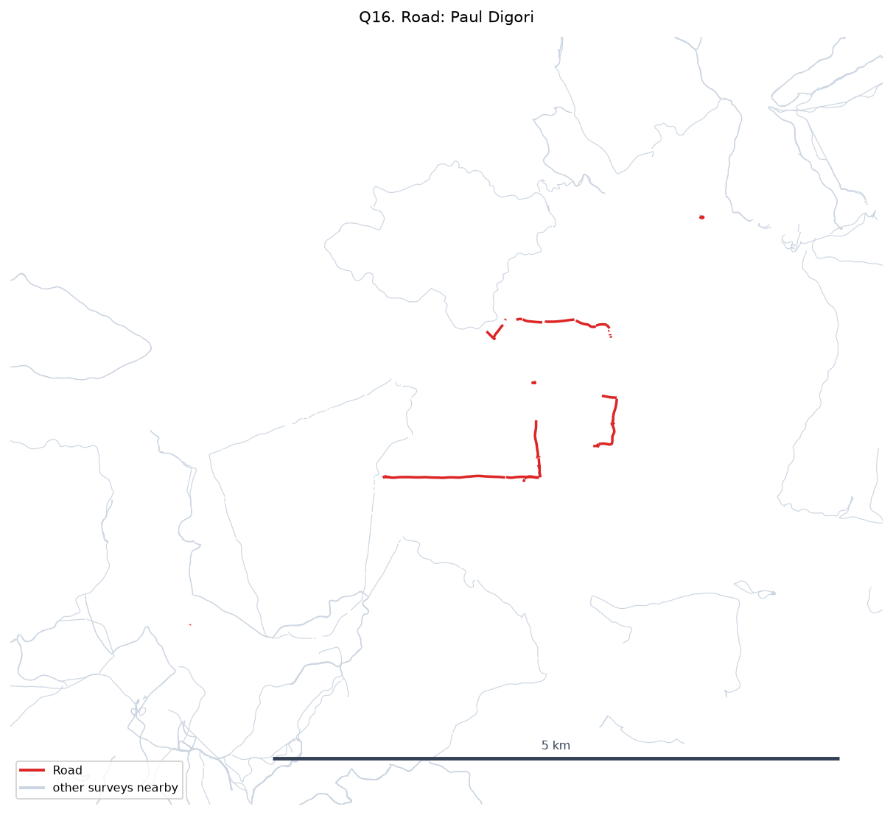
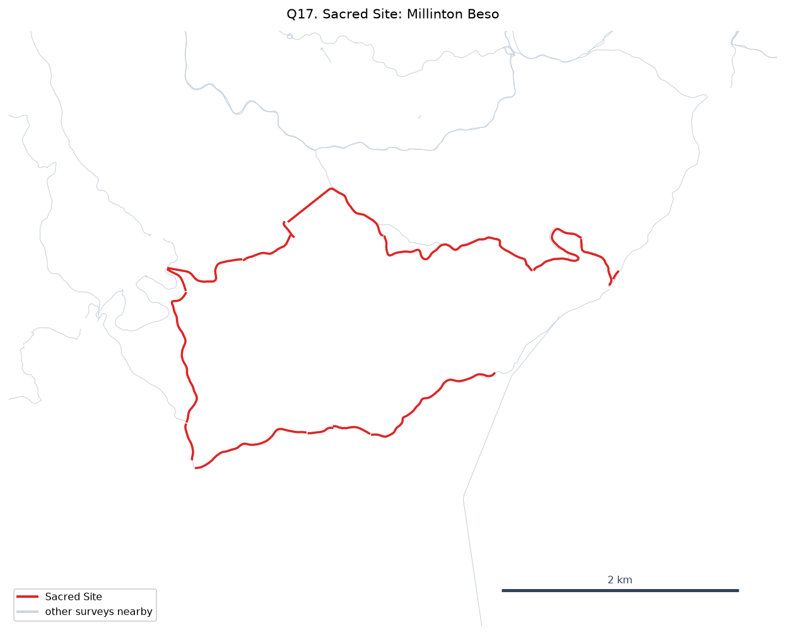
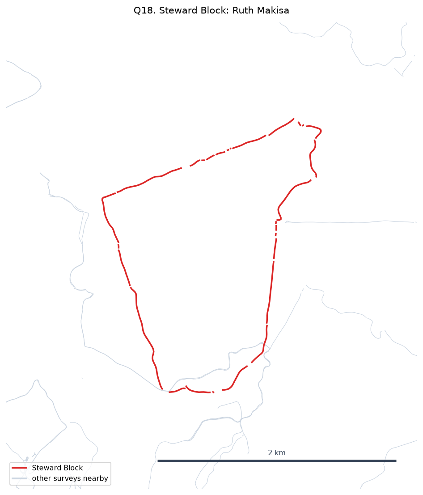
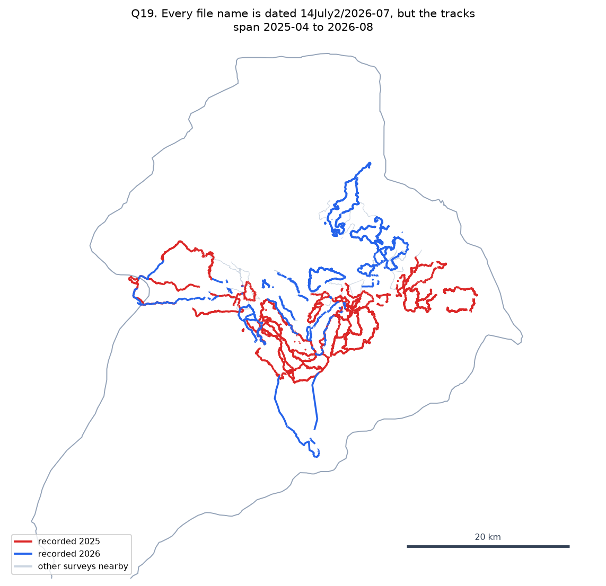
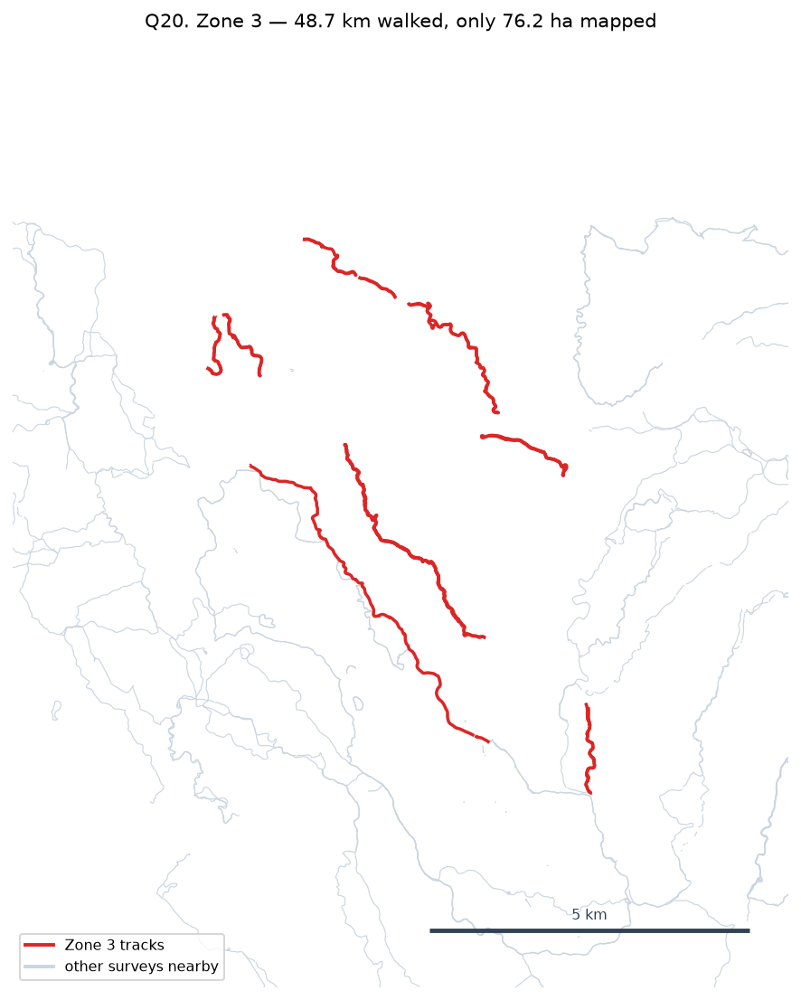

# Field queries — MCA clan boundary mapping

**20 queries** raised from the current data (69 surveys). Each has a map showing the ground in question.

These are questions the data cannot answer on its own. Please mark each one resolved with a short note, and return the pack.

Maps carry no aerial background — they show the recorded walks only, with a scale bar. Nearby surveys are drawn in grey for orientation.

---

## Overlapping clan areas

### Q01. Borori and Darekikol overlap by 286.8 ha

The mapped areas for **Borori** and **Darekikol** share **286.8 ha** — 49.3% of Borori's area and 46.5% of Darekikol's.

Is this shared or disputed ground, is one boundary recorded wrongly, or are these in fact one clan under two names?

> Borori area is inferred; Darekikol area is inferred. Inferred areas are estimates, so an overlap between two inferred areas may be an artefact of estimation.


**Response:**

```

```

---

### Q02. Rondi and Sukandi overlap by 185.9 ha

The mapped areas for **Rondi** and **Sukandi** share **185.9 ha** — 27.7% of Rondi's area and 9.8% of Sukandi's.

Is this shared or disputed ground, is one boundary recorded wrongly, or are these in fact one clan under two names?

> Rondi area is inferred; Sukandi area is inferred/surveyed. Inferred areas are estimates, so an overlap between two inferred areas may be an artefact of estimation.


**Response:**

```

```

---

### Q03. Kasaki and Murai overlap by 154.4 ha

The mapped areas for **Kasaki** and **Murai** share **154.4 ha** — 28.5% of Kasaki's area and 77.6% of Murai's.

Is this shared or disputed ground, is one boundary recorded wrongly, or are these in fact one clan under two names?

> Kasaki area is inferred; Murai area is surveyed. Inferred areas are estimates, so an overlap between two inferred areas may be an artefact of estimation.


**Response:**

```

```

---

### Q04. Majanko and Manoko overlap by 64.8 ha

The mapped areas for **Majanko** and **Manoko** share **64.8 ha** — 23.5% of Majanko's area and 17.4% of Manoko's.

Is this shared or disputed ground, is one boundary recorded wrongly, or are these in fact one clan under two names?

> Majanko area is surveyed; Manoko area is inferred. Inferred areas are estimates, so an overlap between two inferred areas may be an artefact of estimation.


**Response:**

```

```

---

### Q05. Abuankol and Sugulkol overlap by 0.6 ha

The mapped areas for **Abuankol** and **Sugulkol** share **0.6 ha** — 100.0% of Abuankol's area and 0.2% of Sugulkol's.

Is this shared or disputed ground, is one boundary recorded wrongly, or are these in fact one clan under two names?

> Abuankol area is surveyed; Sugulkol area is inferred. Inferred areas are estimates, so an overlap between two inferred areas may be an artefact of estimation.


**Response:**

```

```

---

## Boundaries close to completion

### Q06. Gubai (Kenny Noi) — 4,911 m from closing

**Gubai**, walked by **Kenny Noi** in Zone 8, covers 91.9 km but the ends do not meet: **4,911 m apart**, 5.3% of the distance walked.

Can the remaining stretch be walked to close the boundary? If the gap is deliberate — a river, a road, an agreed open edge — please say what runs along it.

> Until this closes, the clan's area can only be estimated by joining the ends with a straight line.


**Response:**

```

```

---

### Q07. Dusi (Max Mamo) — 1,888 m from closing

**Dusi**, walked by **Max Mamo** in Zone 8, covers 33.0 km but the ends do not meet: **1,888 m apart**, 6.3% of the distance walked.

Can the remaining stretch be walked to close the boundary? If the gap is deliberate — a river, a road, an agreed open edge — please say what runs along it.

> Until this closes, the clan's area can only be estimated by joining the ends with a straight line.


**Response:**

```

```

---

### Q08. Natang (Stafford Gidiri) — 3,392 m from closing

**Natang**, walked by **Stafford Gidiri** in Zone 7B, covers 46.5 km but the ends do not meet: **3,392 m apart**, 7.3% of the distance walked.

Can the remaining stretch be walked to close the boundary? If the gap is deliberate — a river, a road, an agreed open edge — please say what runs along it.

> Until this closes, the clan's area can only be estimated by joining the ends with a straight line.


**Response:**

```

```

---

### Q09. Naharaura (Zechariah Sasavo) — 2,490 m from closing

**Naharaura**, walked by **Zechariah Sasavo** in Zone 6, covers 32.6 km but the ends do not meet: **2,490 m apart**, 7.6% of the distance walked.

Can the remaining stretch be walked to close the boundary? If the gap is deliberate — a river, a road, an agreed open edge — please say what runs along it.

> Until this closes, the clan's area can only be estimated by joining the ends with a straight line.


**Response:**

```

```

---

### Q10. Pina Ora (Alban Ezekiel) — 1,430 m from closing

**Pina Ora**, walked by **Alban Ezekiel** in Zone 6, covers 18.9 km but the ends do not meet: **1,430 m apart**, 8.3% of the distance walked.

Can the remaining stretch be walked to close the boundary? If the gap is deliberate — a river, a road, an agreed open edge — please say what runs along it.

> Until this closes, the clan's area can only be estimated by joining the ends with a straight line.


**Response:**

```

```

---

## Boundaries that cannot yet give an area

### Q11. Zambiko (Sylvester Anai) — recorded in 5 separate pieces

**Zambiko**, walked by **Sylvester Anai** in Zone 2, covers 5.7 km but is recorded as **5 disconnected pieces**, needing 24,374 m of straight-line joins to form a ring (474.7% of the distance walked).

Are the missing stretches still to be walked, or were they walked and not recorded? Should these pieces be treated as one boundary at all?

> No area is reported for this clan while the boundary is this open.


**Response:**

```

```

---

### Q12. (no clan recorded) (Paul Digori) — recorded in 9 separate pieces

**This survey**, walked by **Paul Digori** in Zone 7A, covers 4.3 km but is recorded as **9 disconnected pieces**, needing 15,078 m of straight-line joins to form a ring (385.4% of the distance walked).

Are the missing stretches still to be walked, or were they walked and not recorded? Should these pieces be treated as one boundary at all?

> No area is reported for this clan while the boundary is this open.


**Response:**

```

```

---

### Q13. Nituri (Newton Muraba) — recorded in 9 separate pieces

**Nituri**, walked by **Newton Muraba** in Zone 2, covers 5.3 km but is recorded as **9 disconnected pieces**, needing 11,440 m of straight-line joins to form a ring (229.2% of the distance walked).

Are the missing stretches still to be walked, or were they walked and not recorded? Should these pieces be treated as one boundary at all?

> No area is reported for this clan while the boundary is this open.


**Response:**

```

```

---

### Q14. Tuoko (Kaupa Dota) — recorded in 7 separate pieces

**Tuoko**, walked by **Kaupa Dota** in Zone 2, covers 11.2 km but is recorded as **7 disconnected pieces**, needing 21,040 m of straight-line joins to form a ring (202.0% of the distance walked).

Are the missing stretches still to be walked, or were they walked and not recorded? Should these pieces be treated as one boundary at all?

> No area is reported for this clan while the boundary is this open.


**Response:**

```

```

---

### Q15. Deari (Anthony Irimari) — recorded in 2 separate pieces

**Deari**, walked by **Anthony Irimari** in Zone 3, covers 5.3 km but is recorded as **2 disconnected pieces**, needing 9,944 m of straight-line joins to form a ring (197.8% of the distance walked).

Are the missing stretches still to be walked, or were they walked and not recorded? Should these pieces be treated as one boundary at all?

> No area is reported for this clan while the boundary is this open.



**Response:**

```

```

---

## Surveys that are not clan land boundaries

### Q16. Road: Paul Digori

This survey is recorded as a **Road**, not a clan land boundary — walked by **Paul Digori** (Zone 7A), 13 track(s), 4.3 km, attributed to **no clan recorded**.

Should it count towards that clan's mapped land area, be reported separately, or be excluded from the boundary figures altogether?

> Currently included in the totals. It is tagged by type and can be filtered out in one step once decided.



**Response:**

```

```

---

### Q17. Sacred Site: Millinton Beso

This survey is recorded as a **Sacred Site**, not a clan land boundary — walked by **Millinton Beso** (Zone 2), 3 track(s), 10.6 km, attributed to **Sukandi**.

Should it count towards that clan's mapped land area, be reported separately, or be excluded from the boundary figures altogether?

> Currently included in the totals. It is tagged by type and can be filtered out in one step once decided.



**Response:**

```

```

---

### Q18. Steward Block: Ruth Makisa

This survey is recorded as a **Steward Block**, not a clan land boundary — walked by **Ruth Makisa** (Zone 7B), 1 track(s), 6.3 km, attributed to **no clan recorded**.

Should it count towards that clan's mapped land area, be reported separately, or be excluded from the boundary figures altogether?

> Currently included in the totals. It is tagged by type and can be filtered out in one step once decided.



**Response:**

```

```

---

## Dates that disagree

### Q19. Every file name is dated 14July2/2026-07, but the tracks span 2025-04 to 2026-08

**40 of 52 surveys** carry a file-name date that does not match the GPS timestamps inside them — in fact **none of them match**. File names give 14July2/2026-07, while the tracks themselves were recorded between **2025-04** and **2026-08**. 20 surveys contain tracks recorded across more than one month.

Is the file-name date the date the files were compiled or submitted, rather than when the boundary was walked? If so we will take the survey date from the GPS timestamps instead, which are the only per-track dates available.

> Until this is settled the `survey_date` attribute should not be relied on. Nothing downstream uses it, so no figures change either way — but it is wrong in the data as it stands.



**Response:**

```

```

---

## Zones returning little mapped area

### Q20. Zone 3 — 48.7 km walked, only 76.2 ha mapped

**Zone 3** has 8.0 surveys and 17.0 tracks covering 48.7 km, but yields only **76.2 ha** of mapped area — far less per kilometre walked than the other zones.

Is this the full set of surveys for this zone, or is more still to come? Were these boundaries walked in full?

> Median tracks per survey across all zones is 5; in Zone 3 it is 2.



**Response:**

```

```

---
