# Field queries — MCA clan boundary mapping

**14 queries** raised from the current data (69 surveys). Each has a map showing the ground in question.

These are questions the data cannot answer on its own. Please mark each one resolved with a short note, and return the pack.

Maps carry no aerial background — they show the recorded walks only, with a scale bar. Nearby surveys are drawn in grey for orientation.

## Where the queries are

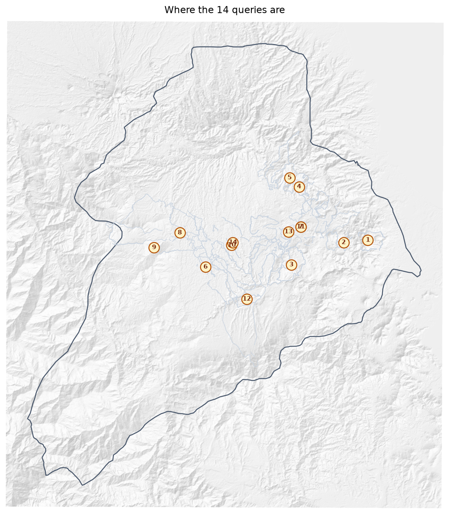

---

## Boundaries close to completion

### Q01. Gubai (Kenny Noi) — 4,911 m from closing

**Gubai**, walked by **Kenny Noi** in Zone 8, covers 91.9 km but the ends do not meet: **4,911 m apart**, 5.3% of the distance walked.

Can the remaining stretch be walked to close the boundary? If the gap is deliberate — a river, a road, an agreed open edge — please say what runs along it.

> Until this closes, the clan's area can only be estimated by joining the ends with a straight line.

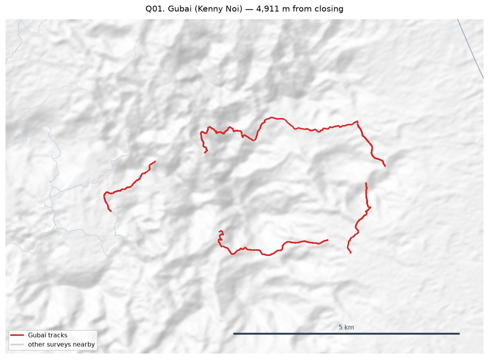

**Response:**

```

```

---

### Q02. Dusi (Max Mamo) — 1,888 m from closing

**Dusi**, walked by **Max Mamo** in Zone 8, covers 33.0 km but the ends do not meet: **1,888 m apart**, 6.3% of the distance walked.

Can the remaining stretch be walked to close the boundary? If the gap is deliberate — a river, a road, an agreed open edge — please say what runs along it.

> Until this closes, the clan's area can only be estimated by joining the ends with a straight line.

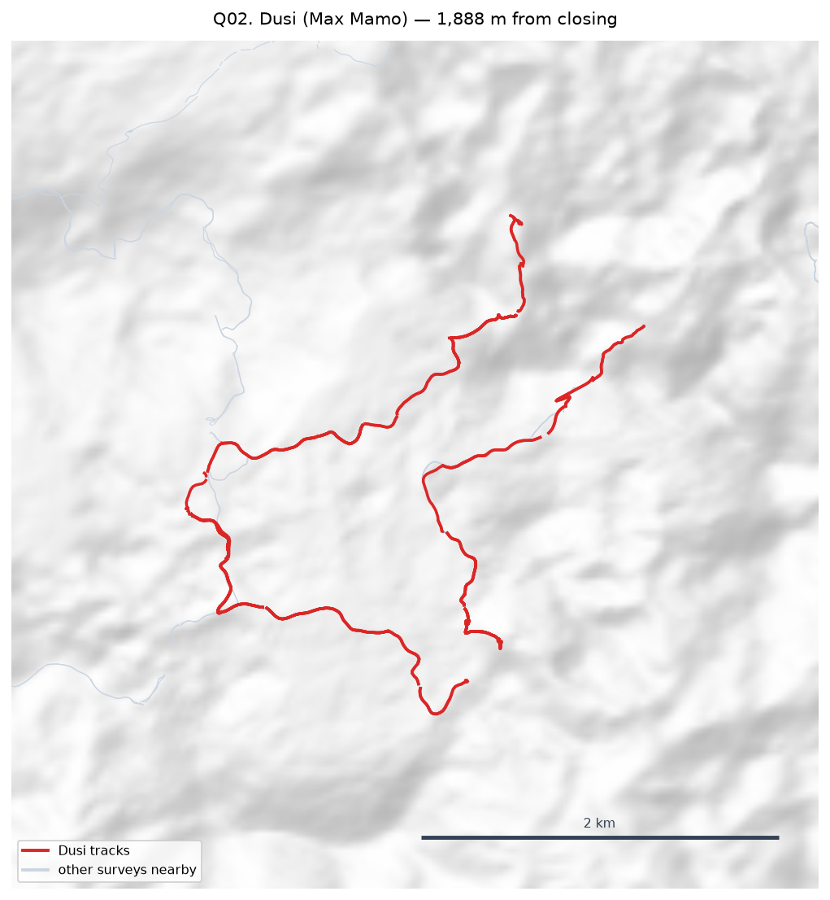

**Response:**

```

```

---

### Q03. Natang (Stafford Gidiri) — 3,392 m from closing

**Natang**, walked by **Stafford Gidiri** in Zone 7B, covers 46.5 km but the ends do not meet: **3,392 m apart**, 7.3% of the distance walked.

Can the remaining stretch be walked to close the boundary? If the gap is deliberate — a river, a road, an agreed open edge — please say what runs along it.

> Until this closes, the clan's area can only be estimated by joining the ends with a straight line.

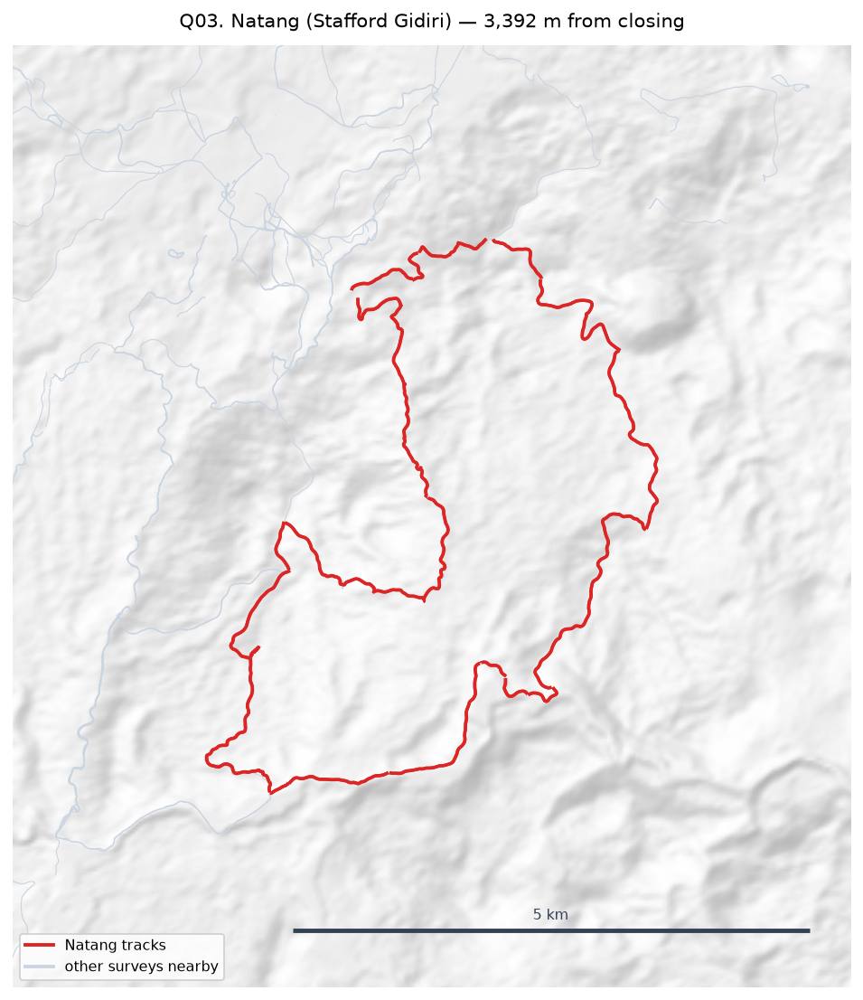

**Response:**

```

```

---

### Q04. Naharaura (Zechariah Sasavo) — 2,490 m from closing

**Naharaura**, walked by **Zechariah Sasavo** in Zone 6, covers 32.6 km but the ends do not meet: **2,490 m apart**, 7.6% of the distance walked.

Can the remaining stretch be walked to close the boundary? If the gap is deliberate — a river, a road, an agreed open edge — please say what runs along it.

> Until this closes, the clan's area can only be estimated by joining the ends with a straight line.

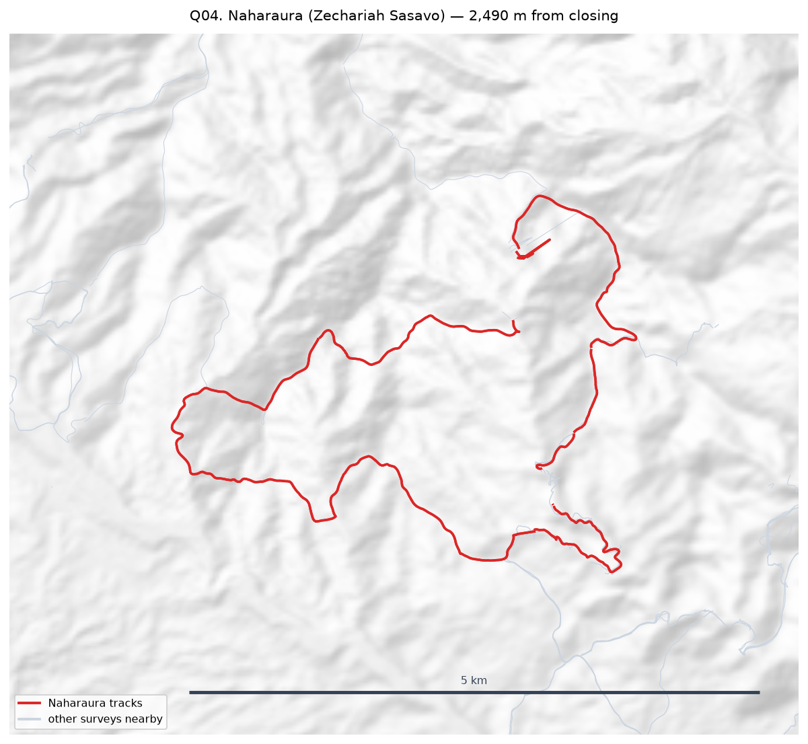

**Response:**

```

```

---

### Q05. Pina Ora (Alban Ezekiel) — 1,430 m from closing

**Pina Ora**, walked by **Alban Ezekiel** in Zone 6, covers 18.9 km but the ends do not meet: **1,430 m apart**, 8.3% of the distance walked.

Can the remaining stretch be walked to close the boundary? If the gap is deliberate — a river, a road, an agreed open edge — please say what runs along it.

> Until this closes, the clan's area can only be estimated by joining the ends with a straight line.

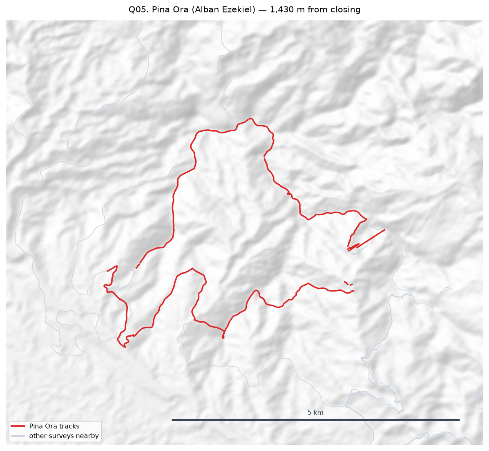

**Response:**

```

```

---

## Boundaries that cannot yet give an area

### Q06. Zambiko (Sylvester Anai) — recorded in 5 separate pieces

**Zambiko**, walked by **Sylvester Anai** in Zone 2, covers 5.7 km but is recorded as **5 disconnected pieces**, needing 24,374 m of straight-line joins to form a ring (474.7% of the distance walked).

Are the missing stretches still to be walked, or were they walked and not recorded? Should these pieces be treated as one boundary at all?

> No area is reported for this clan while the boundary is this open.

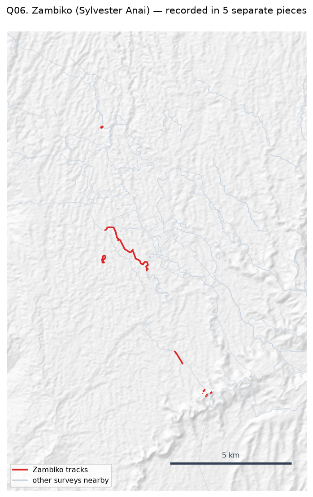

**Response:**

```

```

---

### Q07. (no clan recorded) (Paul Digori) — recorded in 9 separate pieces

**This survey**, walked by **Paul Digori** in Zone 7A, covers 4.3 km but is recorded as **9 disconnected pieces**, needing 15,078 m of straight-line joins to form a ring (385.4% of the distance walked).

Are the missing stretches still to be walked, or were they walked and not recorded? Should these pieces be treated as one boundary at all?

> No area is reported for this clan while the boundary is this open.

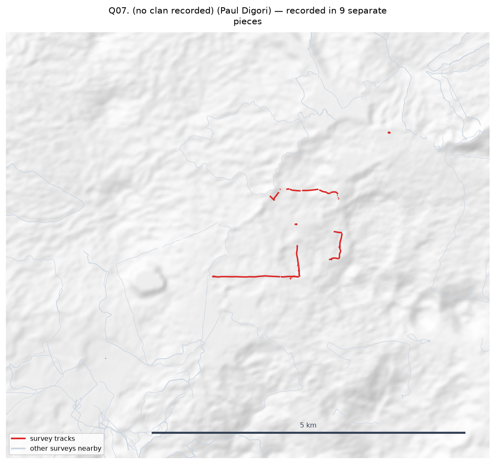

**Response:**

```

```

---

### Q08. Nituri (Newton Muraba) — recorded in 9 separate pieces

**Nituri**, walked by **Newton Muraba** in Zone 2, covers 5.3 km but is recorded as **9 disconnected pieces**, needing 11,440 m of straight-line joins to form a ring (229.2% of the distance walked).

Are the missing stretches still to be walked, or were they walked and not recorded? Should these pieces be treated as one boundary at all?

> No area is reported for this clan while the boundary is this open.

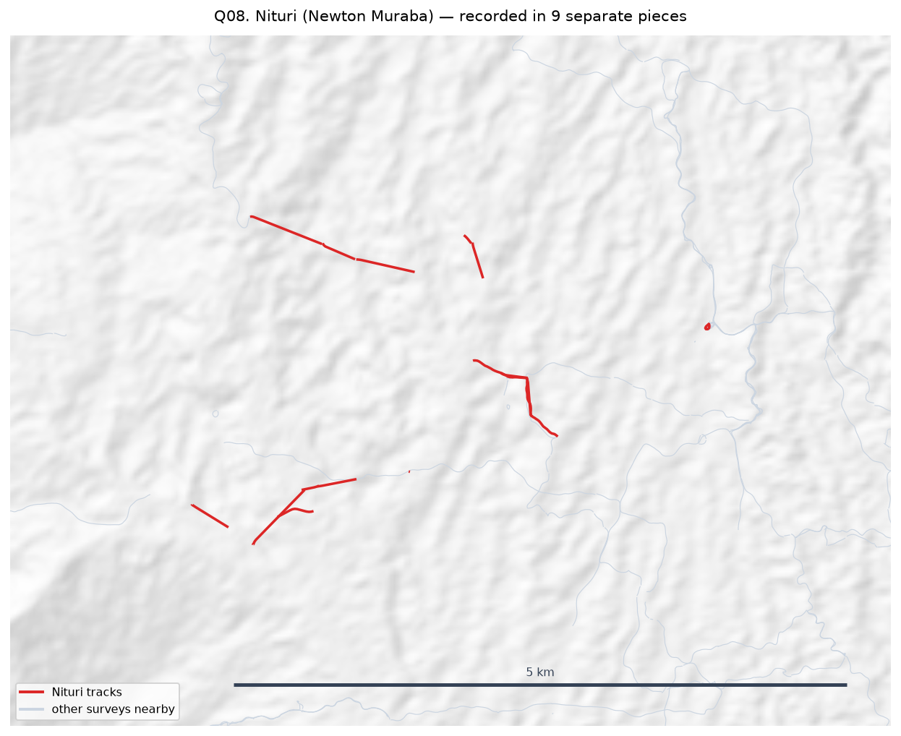

**Response:**

```

```

---

### Q09. Tuoko (Kaupa Dota) — recorded in 7 separate pieces

**Tuoko**, walked by **Kaupa Dota** in Zone 2, covers 11.2 km but is recorded as **7 disconnected pieces**, needing 21,040 m of straight-line joins to form a ring (202.0% of the distance walked).

Are the missing stretches still to be walked, or were they walked and not recorded? Should these pieces be treated as one boundary at all?

> No area is reported for this clan while the boundary is this open.

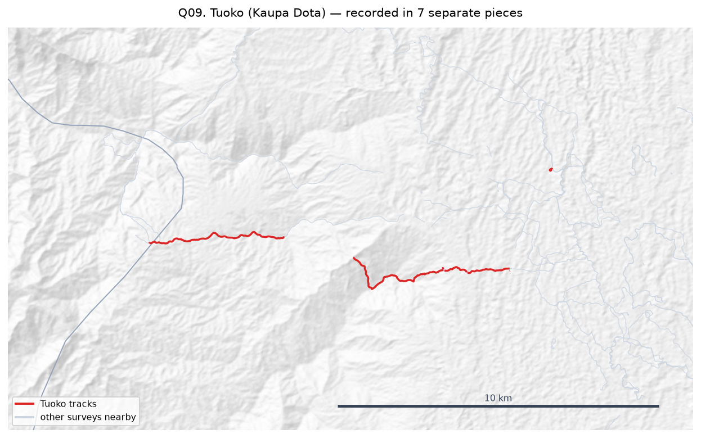

**Response:**

```

```

---

### Q10. Deari (Anthony Irimari) — recorded in 2 separate pieces

**Deari**, walked by **Anthony Irimari** in Zone 3, covers 5.3 km but is recorded as **2 disconnected pieces**, needing 9,944 m of straight-line joins to form a ring (197.8% of the distance walked).

Are the missing stretches still to be walked, or were they walked and not recorded? Should these pieces be treated as one boundary at all?

> No area is reported for this clan while the boundary is this open.


**Response:**

```

```

---

## Surveys that are not clan land boundaries

### Q11. Road: Paul Digori

This survey is recorded as a **Road**, not a clan land boundary — walked by **Paul Digori** (Zone 7A), 13 track(s), 4.3 km, attributed to **no clan recorded**.

Should it count towards that clan's mapped land area, be reported separately, or be excluded from the boundary figures altogether?

> Currently included in the totals. It is tagged by type and can be filtered out in one step once decided.


**Response:**

```

```

---

### Q12. Sacred Site: Millinton Beso

This survey is recorded as a **Sacred Site**, not a clan land boundary — walked by **Millinton Beso** (Zone 2), 3 track(s), 10.6 km, attributed to **Sukandi**.

Should it count towards that clan's mapped land area, be reported separately, or be excluded from the boundary figures altogether?

> Currently included in the totals. It is tagged by type and can be filtered out in one step once decided.

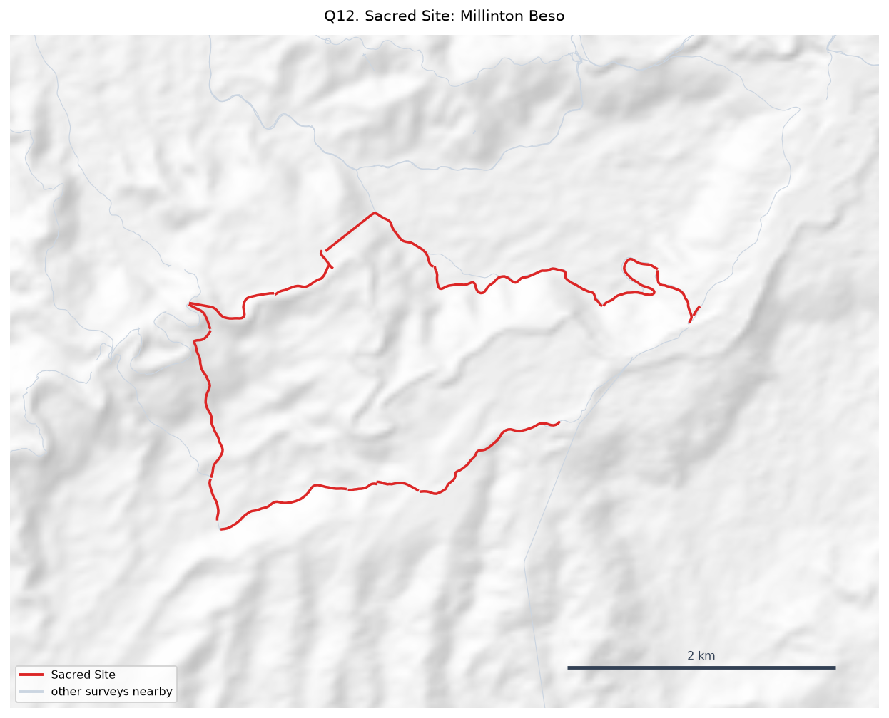

**Response:**

```

```

---

### Q13. Steward Block: Ruth Makisa

This survey is recorded as a **Steward Block**, not a clan land boundary — walked by **Ruth Makisa** (Zone 7B), 1 track(s), 6.3 km, attributed to **no clan recorded**.

Should it count towards that clan's mapped land area, be reported separately, or be excluded from the boundary figures altogether?

> Currently included in the totals. It is tagged by type and can be filtered out in one step once decided.


**Response:**

```

```

---

## Zones returning little mapped area

### Q14. Zone 3 — 48.7 km walked, only 76.2 ha mapped

**Zone 3** has 8.0 surveys and 17.0 tracks covering 48.7 km, but yields only **76.2 ha** of mapped area — far less per kilometre walked than the other zones.

Is this the full set of surveys for this zone, or is more still to come? Were these boundaries walked in full?

> Median tracks per survey across all zones is 5; in Zone 3 it is 2.

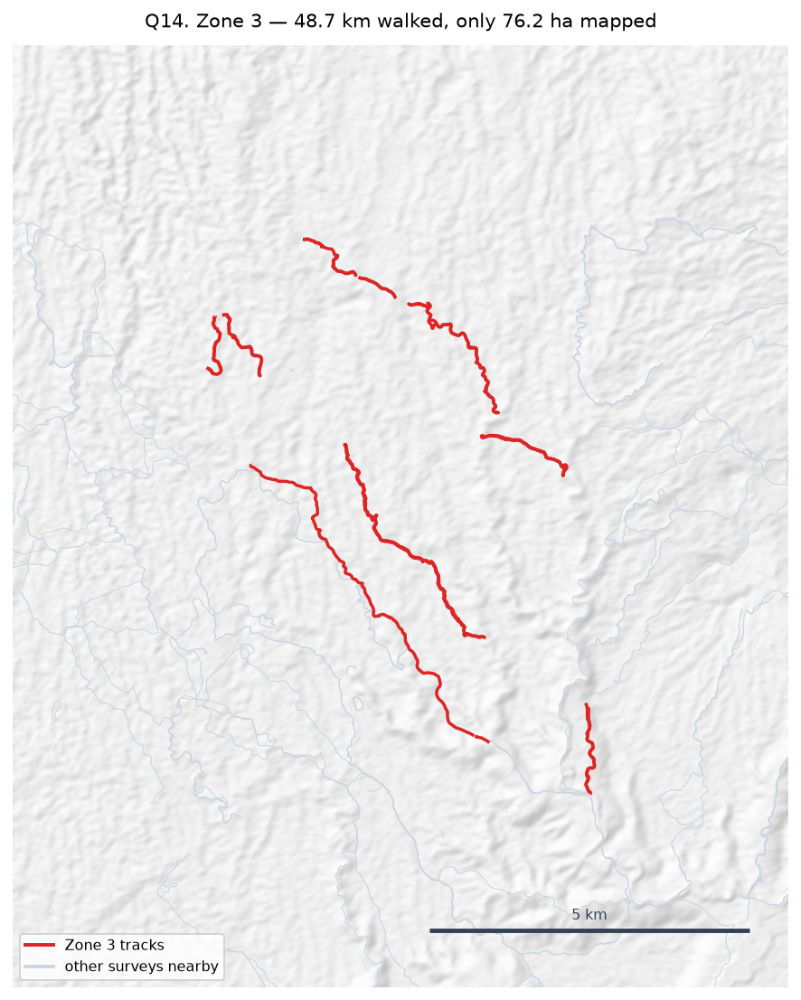

**Response:**

```

```

---
